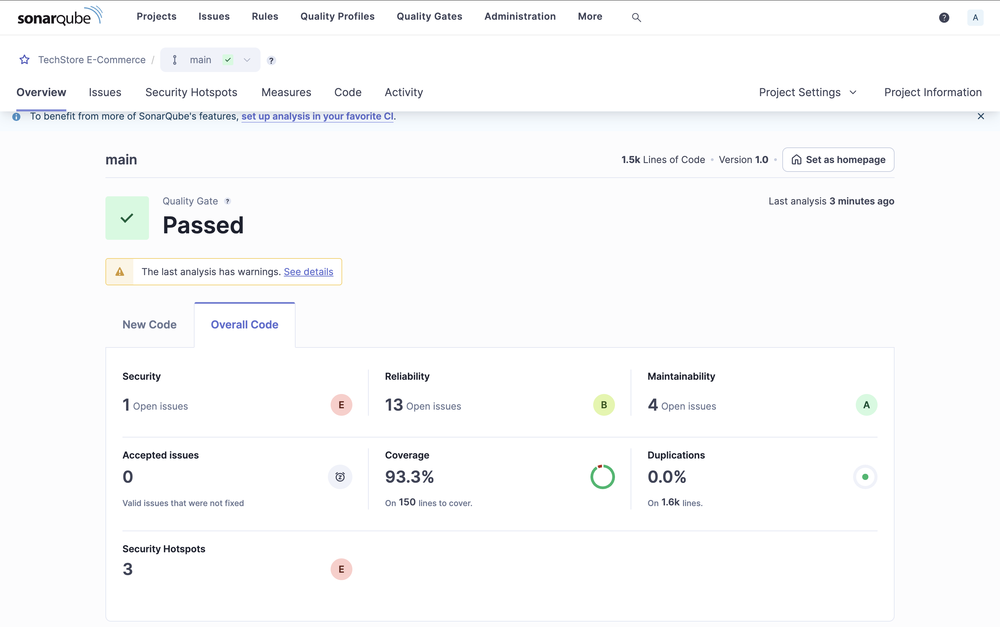
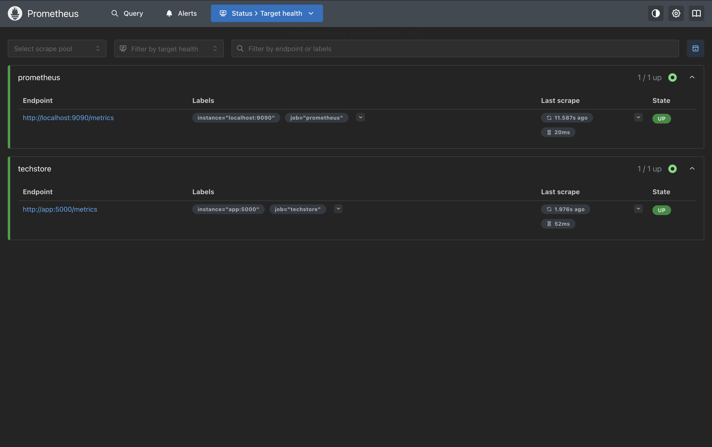
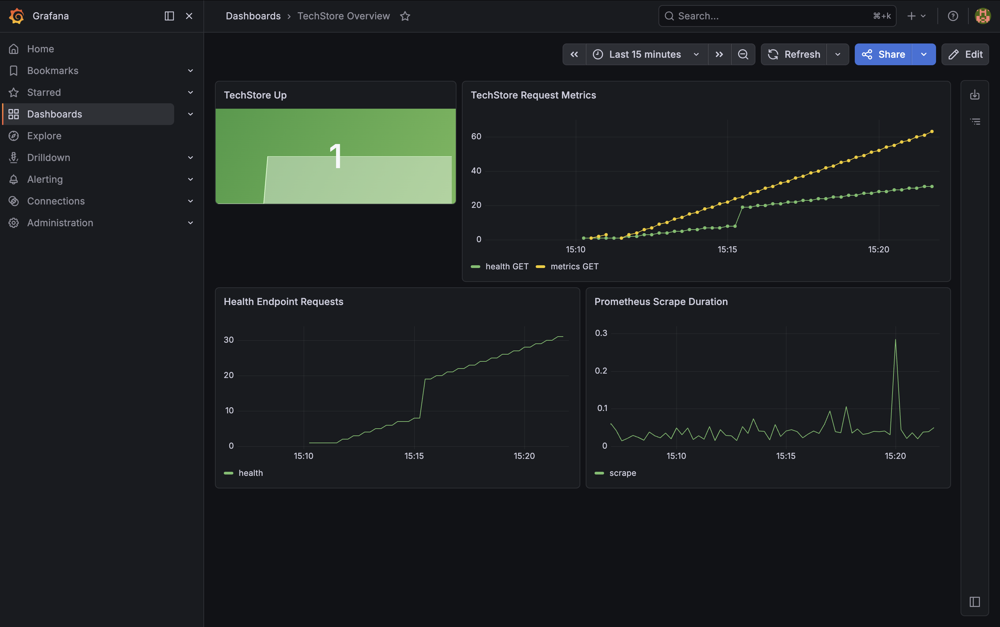
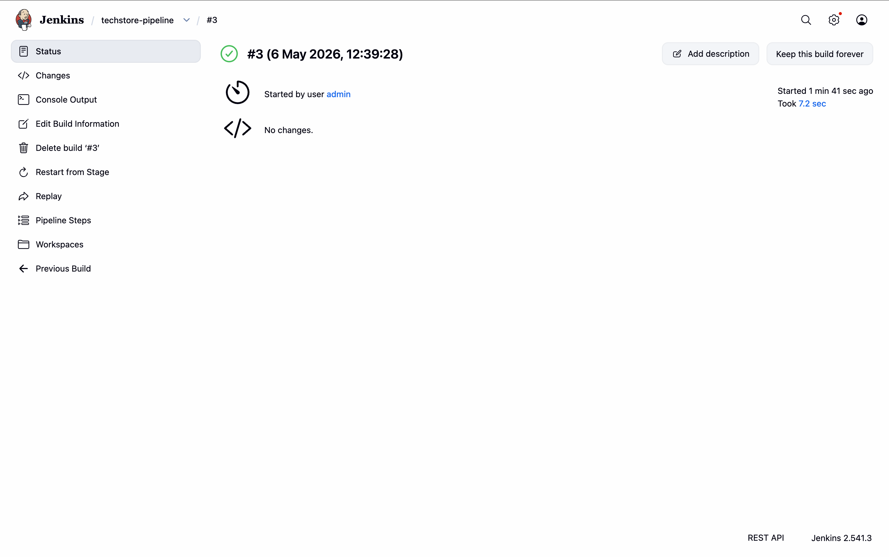
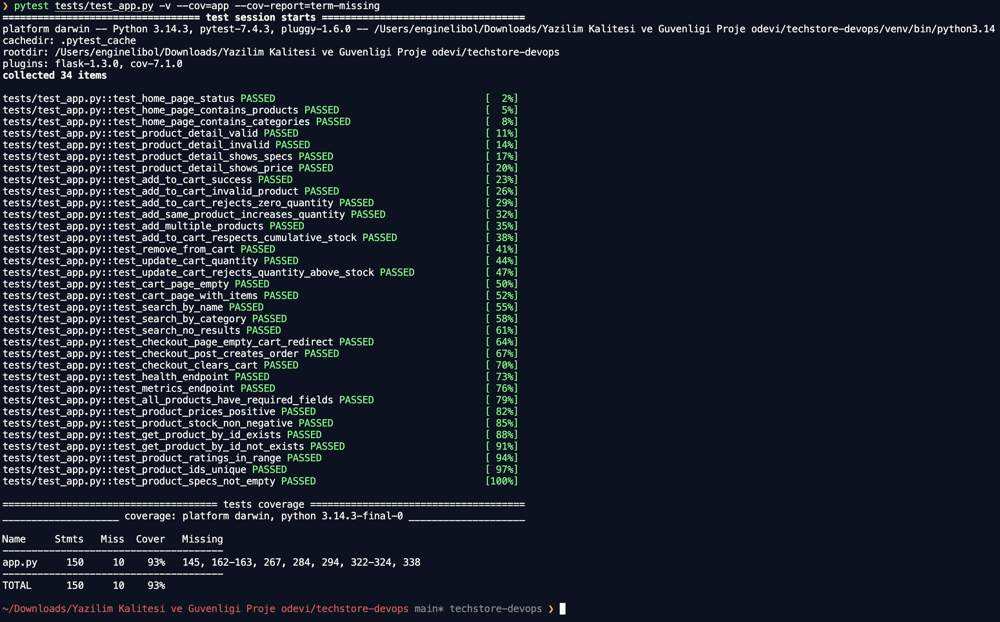
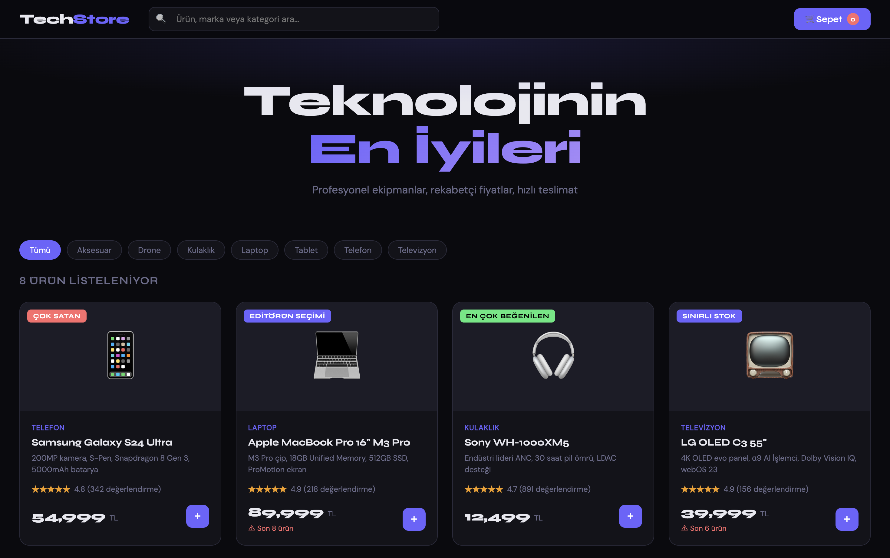
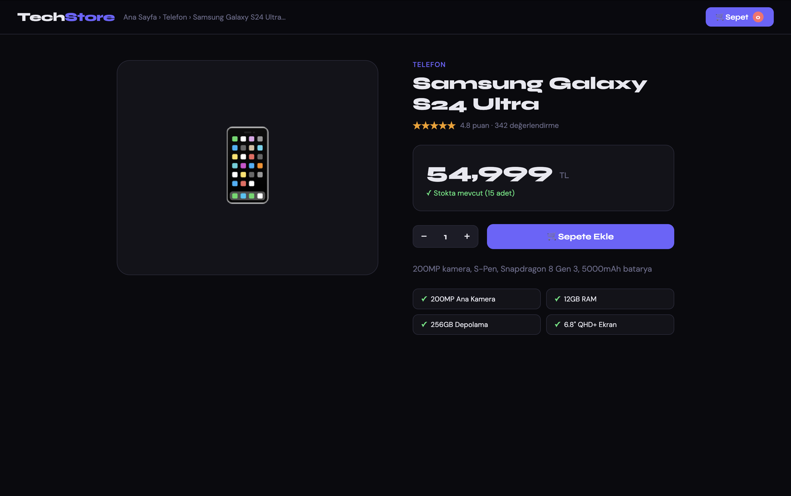
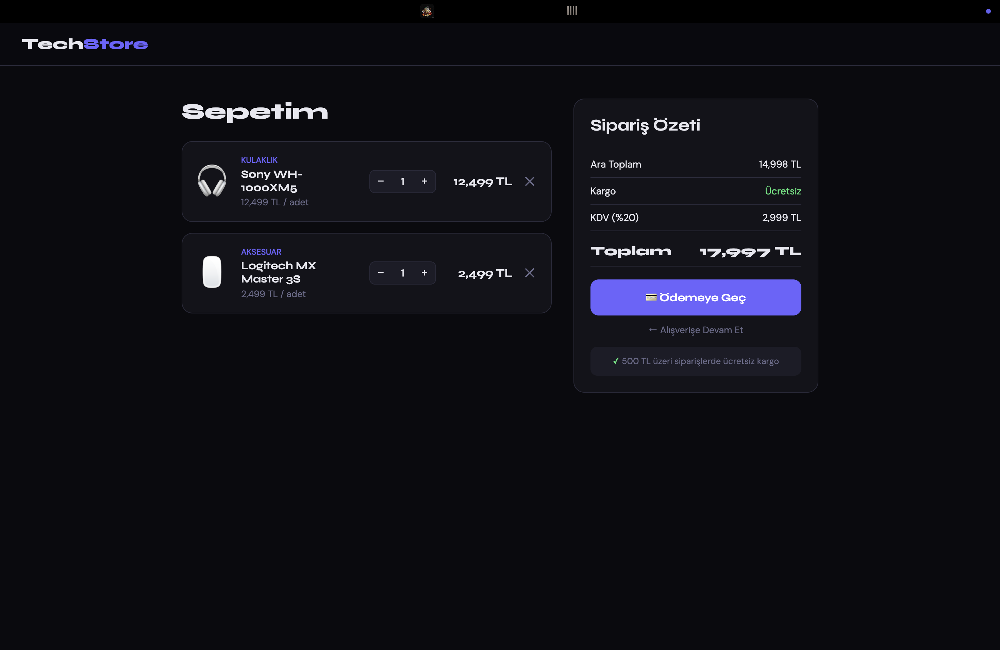
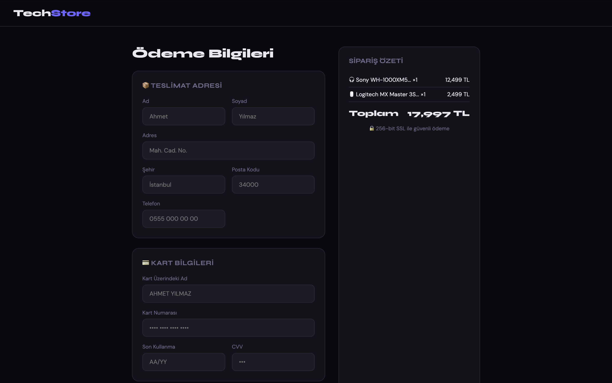
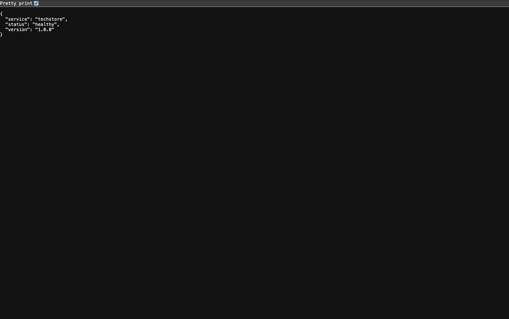

# TechStore DevOps Proje Raporu

## 1. Proje Bilgileri

- Öğrenci: Engin Elibol
- Numara: 2310238554
- Ders: Yazılım Kalitesi ve Güvenliği
- Repo Linki: [yazilim-kalitesi-ve-guvenligi-projesi](https://github.com/Sqap85/yazilim-kalitesi-ve-guvenligi-projesi)

## 2. Proje Özeti

Bu projede Flask tabanlı bir e-ticaret uygulaması için temel DevOps hattı hazırlandı. Uygulama birim testleriyle doğrulandı, Docker ile paketlendi, Jenkins pipeline dosyası düzenlendi, SonarQube ve Prometheus/Grafana yapılandırmaları teslime uygun hale getirildi.

Yerel doğrulama sonucu:

- Birim test sayısı: `34`
- UI test sayısı: `10`
- Hedef coverage: `%80+`
- Ölçülen coverage: `%93`
- UI test sonucu: `10/10 geçti`
- Uygulama servis endpoint'leri: `/`, `/product/<id>`, `/cart`, `/checkout`, `/health`, `/metrics`

## 3. Adımlarda Karşılaşılan Zorluklar ve Çözümler

### Adım 1: Proje yapısının hazırlanması

Sorun:
Arşivden çıkan proje klasörü doğrudan çalıştırılabilir görünse de test çalıştırma sırasında modül yolu kaynaklı hata oluştu.

Çözüm:
`tests/conftest.py` eklenerek proje kök dizini test ortamına güvenli biçimde tanıtıldı.

### Adım 2: Yerel çalıştırma ve bağımlılıklar

Sorun:
Rehberde `pytest-cov` ve `webdriver-manager` kullanılıyor fakat bunlar bağımlılık listesinde yer almıyordu.

Çözüm:
`requirements.txt` güncellendi ve eksik geliştirme/test bağımlılıkları eklendi.

### Adım 3: Testlerin güvenilirliği

Sorun:
Sepete ekleme ve güncelleme akışlarında geçersiz adet, kümülatif stok aşımı ve hatalı JSON gibi durumlar eksik doğrulanıyordu.

Çözüm:
`app.py` içinde istek doğrulama katmanı güçlendirildi, ek testlerle bu davranışlar güvence altına alındı.

### Adım 4: Jenkins pipeline güvenilirliği

Sorun:
Pipeline içinde UI testleri başarısız olsa bile stage başarılı görünebiliyordu. Ayrıca deploy aşaması sabit Docker Hub kullanıcı adı nedeniyle kırılabilirdi.

Çözüm:
`Jenkinsfile` güncellenerek UI testlerinde hata gizleme kaldırıldı, deploy aşaması yerel oluşturulan imajı kullanacak şekilde düzeltildi.

## 4. CI/CD Pipeline'ın Kaliteye Katkısı

Pipeline aşağıdaki hataları erken aşamada yakalayacak şekilde tasarlandı:

- Kodun test ortamında import edilememesi
- Sepet ve checkout akışındaki iş mantığı hataları
- Coverage düşüşleri
- SonarQube kalite kapısı ihlalleri
- Docker build veya deploy kaynaklı servis erişim problemleri
- `/health` smoke test başarısızlıkları

Bu sayede sorunların üretim öncesi görünür olması sağlanır ve manuel kontrol yükü azalır.

## 5. SonarQube Bulguları ve İyileştirmeler

Yerel kod incelemesinde aşağıdaki iyileştirmeler yapıldı:

- Giriş doğrulama eksikleri giderildi
- Rastgele kategori sıralaması deterministik hale getirildi
- Hata gizleyen pipeline davranışı kaldırıldı
- Test sayısı artırılarak kritik akışlar daha iyi kapsandı

SonarQube doğrulama sonucu:

- Proje: `techstore`
- Quality Gate Durumu: `PASSED`

SonarQube ekran görüntüsü:

## 6. Grafana Dashboard

Önerilen paneller:

1. `rate(http_requests_total[1m])`
2. `histogram_quantile(0.95, rate(http_request_duration_seconds_bucket[5m]))`
3. `topk(5, cart_add_total)`
4. `rate(http_requests_total{status=~"5.."}[5m]) / rate(http_requests_total[5m])`

Yerel dashboard doğrulaması:

- Dashboard adı: `TechStore Overview`
- Prometheus target durumu: `techstore = UP`

Prometheus ekran görüntüsü:

Grafana ekran görüntüsü:

## 7. Jenkins Build Ekran Görüntüsü

Yerel Jenkins doğrulaması:

- Job adı: `techstore-pipeline`
- Başarılı build: `#3`
- Son durum: `SUCCESS`

## 8. Coverage Raporu

- Komut: `pytest tests/test_app.py -v --cov=app --cov-report=term-missing`
- Sonuç: `34 passed`, `TOTAL %93`

## 9. UI Test Sonucu

- Komut: `BASE_URL=http://127.0.0.1:5001 pytest tests/test_ui.py -v`
- Sonuç: `10/10 test geçti`

Uygulama ekran görüntüleri:

## 10. Sonuç

Proje teslim kriterlerine uygun hale getirilmiş, test ve pipeline tarafı güçlendirilmiş, ekran görüntüleriyle desteklenmiş bir rapor hazırlandı. Mevcut haliyle rapor teslim için kullanılabilir.
